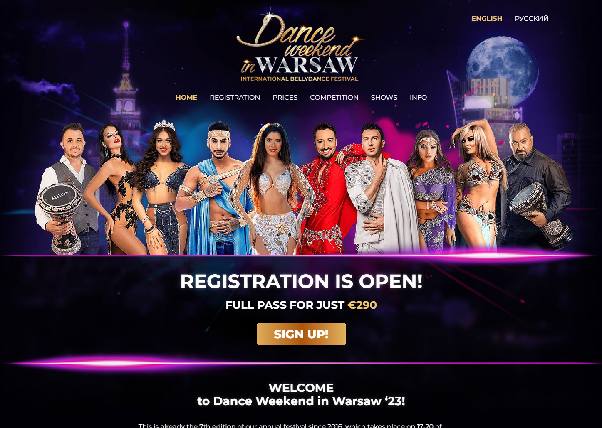

# Dance weekend in Warsaw festival's website

This is a multilingual website I have created for an annual dance festival. As the sole contributor, I have completed all aspects of this project, from design in Figma to development to hosting. One of the primary challenges was developing a complex multi-step registration form that adapts to users' selections and dynamically adjusts the options available. Submissions are securely stored in the client's Notion database and sent via Sendinblue API to both organizers and participants. Additionally, the website features a responsive email design created with the MJML framework and supports secure payments through PayPal and Stripe integrations. The website is deployed on a remote Docker system using CI/CD with GitHub Actions, ensuring seamless updates and maintenance.

## Live deployment

https://danceweekend.art

## Stack

- HTML5
- CSS3 (CSS Modules)
- TypeScript
- Next.js
- MJML
- Material UI (MUI)
- React Hook Form
- i18n with NextTranslate
- Docker
- Notion API
- PayPal API
- Stripe API
- Sendinblue API
